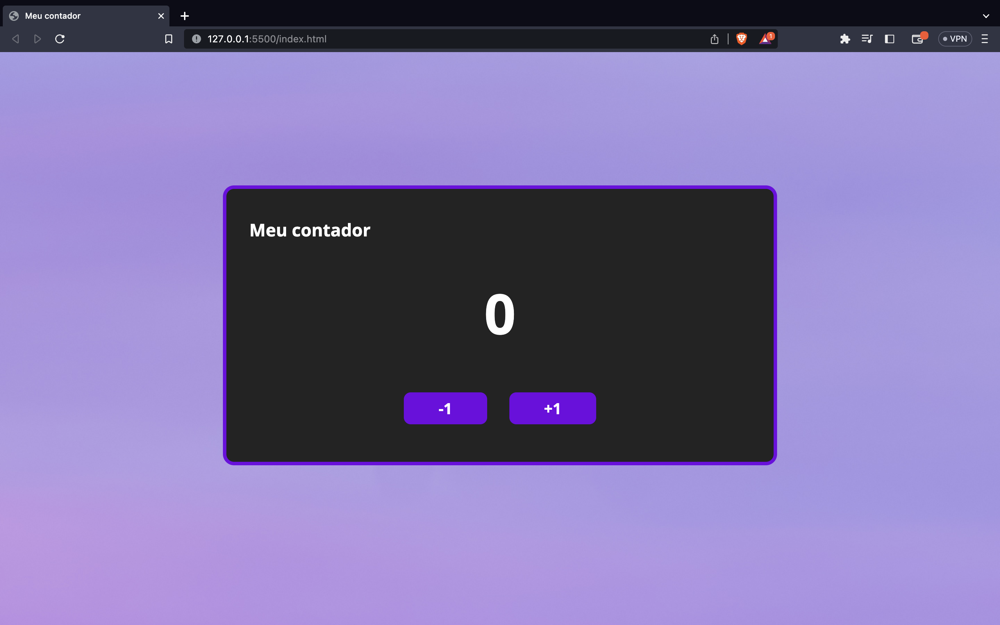

# ContadorJS
## Breve descrição
Um projeto que envolve a manipulação do DOM e adição de eventos para a criação de um contador, com HTML, CSS e JavaScript.

## Tecnologias utilizadas
As tecnologias utilizadas foram: HTML, CSS, e JavaScript.

## Funcionalidades
Ao clicar no botão +1, o código incrementa +1 ao contador. Da mesma maneira, ao clicar no botão -1, o código decrementa -1 do código.

